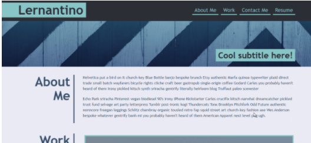

# Professional Portfolio Challenge
Module 2: Advanced CSS Challenge: Professional Portfolio

# The Challenge

Build your professional portfolio page so that potential employer's can view a portfolio of your work samples and assess whether you are a good candiate for an open position. 

## Acceptance Criteria: 
-   When portfolio loads, there should be the developer's name, picture or avatar and links to sections about them, their work and how to contact them
- Navigation links work and scrolls to the corresponding section
- Work projects have title images of the developers application
- the first application should be larger in size than the others
- When the work images are clicked, it brings you to the deployed application
- There are media queries for smaller screens applied

## Additional requirements to webpage: 
-   Add comments before each element and section of the page 
- Add CSS visuals to webpage

## Mock-Up:

The following image demonstrates what the web application's appearance and functionality should look like:
 

# Deployment

To view the project's repository in GitHub, click [here](https://github.com/kelcmitch97/2-professional-portfolio).

To view the deployed application with the GitHub pages link, click [here](https://kelcmitch97.github.io/2-professional-portfolio/).

